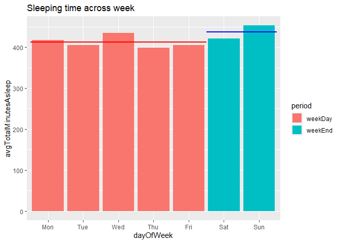

**Bellabeat Case Study**
================
Phua Jun Yu
2023-07-24

> This is an R markdown document to briefly showcase my work in
> Bellabeat data analysis case study as a capstone project for Google
> Data Analytics Certificate specialization on Coursera.

# **Business Task**

### **Stakeholders**

> Primary Stakeholder – Sršen (Co-founder, chief creative officer) <br/>
> Secondary Stakeholder – Sando Mur(Executive team)

### **Description of business task **

> Analyze smart device usage data in order to gain insight into how
> consumers use non-Bellabeat smart devices and apply these insights to
> any one of the Bellabeat products on marketing strategy.

### **Project target**

> 1.  Identify at least 3 trend/relationships from data. <br/>2. 
> Identify underlying consumers’ behaviour pattern description for each
> of the trend in target 1. <br/>3.  Come up with at least 1 aspect of
> suggested marketing strategy of Bellabeat.

### **Important Info about Bellabeat**

> 1.Bellabeat is still a small company, with potential to grow
> large.<br/> 2.There are 5 Bellabeat products <br/> \> Bellabeat
> app<br/> \> Leaf tracker : tracker as bracelet, necklace, or
> clip.<br/> \> Time : tracker as a watch.<br/> \> Spring : water
> bottle<br/> \> Bellabeat membership : subscription for 24/7
> personalized health guidance<br/> 3.Main customer group of Bellabeat
> are women around the globe.<br/> 4.Bellabeat sell through a number of
> online retailers as well as their own e-commerce module on their
> website.<br/> 5.Bellabeat’s marketing strategy currently focuses more
> on digital marketing, such as posts on social media and paid ads on
> YouTube and Google.<br/> 6.Mainly collected data : activity, sleep,
> and stress.<br/>

------------------------------------------------------------------------

# **Data preparation**

### **Data source**

> FitBit Fitness Tracker Data
> <https://www.kaggle.com/datasets/arashnic/fitbit>

### **Limitation of the data**

> 1.Sample size : The data consist of data from 30 Fitbit users, which
> holds a minimum statistical significane.<br/> 2.Time period : The data
> is about the time period between 03.12.2016-05.12.2016, users’
> behaviour might have changed.<br/> 3.Third party data : This is a
> public data on Kaggle, generated by respondents to a distributed
> survey via Amazon Mechanical Turk.<br/> 4.Lack of demographic
> information : The data does not contain any direct information about
> the user profile.<br/> 5.Lack of usage information :

# **Data Inspection & Data Processing **

> The data consist of 18 CSV files, of which some of them have
> overlapping data. There are 12 of them that I choose to use in
> analysis.

### **Description of data**

> [Click
> here](https://www.fitabase.com/media/1930/fitabasedatadictionary102320.pdf)
> to get Metadata documentation of the data.

### **Data problems check**

> Check for missing values
>
> > Only data about weight log “weightLogInfo_merged.csv” has
> > empty/missing values, mostly in ‘fat’ column.
>
> > <details>
> > <summary font size="10">
> > R code to check for missing values
> > </summary>
> >
> > ``` r
> > dailyActivity_raw = read.csv(r'[D:\School\Reading\Google Data Analytic Cert\Case Study\Data\Fitabase Data 4.12.16-5.12.16\dailyActivity_merged.csv]')
> > fileNames <- c('dailyActivity_merged.csv',
> >              'heartrate_seconds_merged.csv',
> >              'minuteCaloriesNarrow_merged.csv',
> >              'minuteCaloriesWide_merged.csv',
> >              'minuteIntensitiesNarrow_merged.csv',
> >              'minuteIntensitiesWide_merged.csv',
> >              'minuteMETsNarrow_merged.csv',
> >              'minuteSleep_merged.csv',
> >              'minuteStepsNarrow_merged.csv',
> >              'minuteStepsWide_merged.csv',
> >              'sleepDay_merged.csv',
> >              'weightLogInfo_merged.csv'
> >              )
> > fileBaseDir <- r'[D:\School\Reading\Google Data Analytic Cert\Case Study\Data\Fitabase Data 4.12.16-5.12.16\]'
> > # checking for empty/missing values using is.na function
> > for (fileName in fileNames){
> >  file <- ""
> >  file <- paste(fileBaseDir ,fileName,sep = "")
> >  data_raw <- read.csv(file)
> >  noNa <- which(is.na(data_raw))
> >  print(paste("The file ",fileName," contains ",length(noNa)," empty values"))
> > }
> > ```
> >
> >     ## [1] "The file  dailyActivity_merged.csv  contains  0  empty values"
> >     ## [1] "The file  heartrate_seconds_merged.csv  contains  0  empty values"
> >     ## [1] "The file  minuteCaloriesNarrow_merged.csv  contains  0  empty values"
> >     ## [1] "The file  minuteCaloriesWide_merged.csv  contains  0  empty values"
> >     ## [1] "The file  minuteIntensitiesNarrow_merged.csv  contains  0  empty values"
> >     ## [1] "The file  minuteIntensitiesWide_merged.csv  contains  0  empty values"
> >     ## [1] "The file  minuteMETsNarrow_merged.csv  contains  0  empty values"
> >     ## [1] "The file  minuteSleep_merged.csv  contains  0  empty values"
> >     ## [1] "The file  minuteStepsNarrow_merged.csv  contains  0  empty values"
> >     ## [1] "The file  minuteStepsWide_merged.csv  contains  0  empty values"
> >     ## [1] "The file  sleepDay_merged.csv  contains  0  empty values"
> >     ## [1] "The file  weightLogInfo_merged.csv  contains  64  empty values"
> >
> > </details>
>
> > | File Name                          | Done | Method/tool used      | Result & remark                                                             |
> > |:-----------------------------------|:-----|:----------------------|:----------------------------------------------------------------------------|
> > | dailyActivity_merged.csv           | T    | Excel filter function | No missing values found.                                                    |
> > | heartrate_seconds_merged.csv       | T    | R isna() function     | No missing values found.                                                    |
> > | minuteCaloriesNarrow_merged.csv    | T    | R isna() function     | No missing values found.                                                    |
> > | minuteCaloriesWide_merged.csv      | T    | R isna() function     | No missing values found.                                                    |
> > | minuteIntensitiesNarrow_merged.csv | T    | R isna() function     | No missing values found.                                                    |
> > | minuteIntensitiesWide_merged.csv   | T    | R isna() function     | No missing values found.                                                    |
> > | minuteMETsNarrow_merged.csv        | T    | R isna() function     | No missing values found.                                                    |
> > | minuteSleep_merged.csv             | T    | R isna() function     | No missing values found.                                                    |
> > | minuteStepsNarrow_merged.csv       | T    | R isna() function     | No missing values found.                                                    |
> > | minuteStepsWide_merged.csv         | T    | R isna() function     | No missing values found.                                                    |
> > | sleepDay_merged.csv                | T    | R isna() function     | No missing values found.                                                    |
> > | weightLogInfo_merged.csv           | T    | R isna() function     | 65 Missing values found. All of the missing values are in the ‘fat’ column. |

> Detect and remove duplicates

> Formatting check
>
> > | File                               | Done | Remark                                                                                                                                                                                              |
> > |:-----------------------------------|:-----|:----------------------------------------------------------------------------------------------------------------------------------------------------------------------------------------------------|
> > | dailyActivity_merged.csv           | T    | “Ambiguous date format : Presentation of “ActivityDate” column in Excel varies because some for dates whose day is less than 13, Excel can not determine without ambiguity the format of the date.” |
> > | heartrate_seconds_merged.csv       | T    | Ambiguous date format : “Time” column                                                                                                                                                               |
> > | minuteCaloriesNarrow_merged.csv    | T    | Ambiguous date format : “ActivityColumn” column the format of the date.                                                                                                                             |
> > | minuteCaloriesWide_merged.csv      | T    | Ambiguous date format : ActivityHour” column.                                                                                                                                                       |
> > | minuteIntensitiesNarrow_merged.csv | T    | Ambiguous date format : “ActivityMinutes” column                                                                                                                                                    |
> > | minuteIntensitiesWide_merged.csv   | T    | Ambiguous date format : “ActivityHour” column                                                                                                                                                       |
> > | minuteMETsNarrow_merged.csv        | T    | Ambiguous date format : “ActivityHour” column                                                                                                                                                       |
> > | minuteSleep_merged.csv             | T    | Ambiguous date format : “date” column                                                                                                                                                               |
> > | minuteStepsNarrow_merged.csv       | T    | Ambiguous date format : “ActivityMinute” column                                                                                                                                                     |
> > | minuteStepsWide_merged.csv         | T    | Ambiguous date format : “ActivityHour” column                                                                                                                                                       |
> > | sleepDay_merged.csv                | T    | Ambiguous date format : “SleepDay” column                                                                                                                                                           |
> > | weightLogInfo_merged.csv           | T    | Ambiguous date format : “Date” column                                                                                                                                                               |
>
> > <details>
> > <summary>
> > Check if numeric values are consistent
> > </summary>
> >
> > ``` r
> > # check for format consistency and data type
> > file <- 'dailyActivity_merged.csv'
> > data <- read.csv(paste(fileBaseDir,file,sep=""))
> > colnames(data)
> > ```
> >
> >     ##  [1] "Id"                       "ActivityDate"            
> >     ##  [3] "TotalSteps"               "TotalDistance"           
> >     ##  [5] "TrackerDistance"          "LoggedActivitiesDistance"
> >     ##  [7] "VeryActiveDistance"       "ModeratelyActiveDistance"
> >     ##  [9] "LightActiveDistance"      "SedentaryActiveDistance" 
> >     ## [11] "VeryActiveMinutes"        "FairlyActiveMinutes"     
> >     ## [13] "LightlyActiveMinutes"     "SedentaryMinutes"        
> >     ## [15] "Calories"
> >
> > ``` r
> > # for dailyActivity, check if the columns are all numeric 
> > col_numeric <- c('TotalSteps','TotalDistance','TrackerDistance','LoggedActivitiesDistance',
> >             'VeryActiveDistance','ModeratelyActiveDistance','LightActiveDistance',
> >             'SedentaryActiveDistance','VeryActiveMinutes','FairlyActiveMinutes',
> >             'LightlyActiveMinutes','SedentaryMinutes','Calories')
> > #check_numeric(dataDf=data,colNum=col_numeric)
> >
> >
> > file <- 'heartrate_seconds_merged.csv'
> > data <- read.csv(paste(fileBaseDir,file,sep=""))
> > colnames(data)
> > ```
> >
> >     ## [1] "Id"    "Time"  "Value"
> >
> > ``` r
> > col_numeric <- c('Value')
> > #check_numeric(dataDf=data,colNum=col_numeric)
> >
> > file <- 'minuteCaloriesWide_merged.csv'
> > data <- read.csv(paste(fileBaseDir,file,sep=""))
> > colnames(data)
> > ```
> >
> >     ##  [1] "Id"           "ActivityHour" "Calories00"   "Calories01"   "Calories02"  
> >     ##  [6] "Calories03"   "Calories04"   "Calories05"   "Calories06"   "Calories07"  
> >     ## [11] "Calories08"   "Calories09"   "Calories10"   "Calories11"   "Calories12"  
> >     ## [16] "Calories13"   "Calories14"   "Calories15"   "Calories16"   "Calories17"  
> >     ## [21] "Calories18"   "Calories19"   "Calories20"   "Calories21"   "Calories22"  
> >     ## [26] "Calories23"   "Calories24"   "Calories25"   "Calories26"   "Calories27"  
> >     ## [31] "Calories28"   "Calories29"   "Calories30"   "Calories31"   "Calories32"  
> >     ## [36] "Calories33"   "Calories34"   "Calories35"   "Calories36"   "Calories37"  
> >     ## [41] "Calories38"   "Calories39"   "Calories40"   "Calories41"   "Calories42"  
> >     ## [46] "Calories43"   "Calories44"   "Calories45"   "Calories46"   "Calories47"  
> >     ## [51] "Calories48"   "Calories49"   "Calories50"   "Calories51"   "Calories52"  
> >     ## [56] "Calories53"   "Calories54"   "Calories55"   "Calories56"   "Calories57"  
> >     ## [61] "Calories58"   "Calories59"
> >
> > ``` r
> > col_numeric <- c('Value')
> > #check_numeric(dataDf=data,colNum=col_numeric)
> > ```
> >
> > </details>

> Outliers
>
> > Found potential outliers in almost all files.
>
> > Found that some data record contains unreasonable amount of recorded
> > activity minute. This indicates that some data record might not
> > reflect the user’s activity on that day.Now we combine with sleep
> > data to see if it is just that the person was sleeping all day
> > (weird but not impossible),it might or might not because the person
> > has a long sleeping time on that day, we have to check the sum of
> > activity time and time in bed to see
>
> > <details>
> > <summary>
> > Check outliers for numeric columns
> > </summary>
> >
> > ``` r
> > col_to_skip <- c('Id',
> >                 'ActivityDate',
> >                 'Time',
> >                 'ActivityHour',
> >                 'ActivityMinute',
> >                 'date',
> >                 'logId',
> >                 'SleepDay',
> >                 'IsManualReport')
> > i <- 0
> >
> > fileNames <- c('dailyActivity_merged.csv',
> >               'heartrate_seconds_merged.csv',
> >               'minuteCaloriesNarrow_merged.csv',
> >               'minuteCaloriesWide_merged.csv',
> >               'minuteIntensitiesNarrow_merged.csv',
> >               'minuteIntensitiesWide_merged.csv',
> >               'minuteMETsNarrow_merged.csv',
> >               'minuteSleep_merged.csv',
> >               'minuteStepsNarrow_merged.csv',
> >               'minuteStepsWide_merged.csv',
> >               'sleepDay_merged.csv'
> > )
> >
> > # checking for potential outliers
> > for (fileName in fileNames){
> >  file <- ""
> >  file <- paste(fileBaseDir ,fileName,sep = "")
> >  data_raw <- read.csv(file)
> >  cols <- colnames(data_raw)
> >  for(col in cols){
> >    allNumeric <- TRUE
> >    if(col %in% col_to_skip) next
> >    # if it is all numeric(quantitative data)
> >    t <- is.numeric(data_raw[[col]])
> >    t1 <-  is.numeric(data_raw[col])
> >    for(no in data_raw[[col]]){
> >      if(!is.numeric(no)){
> >        allNumeric <- FALSE
> >      }
> >    }
> >
> >    if(allNumeric){
> >      # look for potential outliers
> >      x <- data_raw[[col]]
> >      Qs <- quantile(x, prob=c(.25,.5,.75), type=1)
> >      IQR = Qs['75%'] - Qs['25%']
> >      upper_lim = Qs['75%'] + IQR
> >      lower_lim = Qs['25%'] - IQR
> >      noOutliers <- sum(x<lower_lim | x>upper_lim)
> >      # print(paste("Upperlim: ",upper_lim,", lowerLim: ",lower_lim))
> >      if(noOutliers != 0)print(paste("In file ",fileName," column ",col," contains ",noOutliers," potential outliers"))
> >      else print("no potential outliers")
> >    }else{
> >      print("not all numeric")
> >    }
> >    # else it is qualitative data and we do nothing to them for now
> >  }
> > }
> > ```
> >
> >     ## [1] "In file  dailyActivity_merged.csv  column  TotalSteps  contains  32  potential outliers"
> >     ## [1] "In file  dailyActivity_merged.csv  column  TotalDistance  contains  35  potential outliers"
> >     ## [1] "In file  dailyActivity_merged.csv  column  TrackerDistance  contains  34  potential outliers"
> >     ## [1] "In file  dailyActivity_merged.csv  column  LoggedActivitiesDistance  contains  32  potential outliers"
> >     ## [1] "In file  dailyActivity_merged.csv  column  VeryActiveDistance  contains  106  potential outliers"
> >     ## [1] "In file  dailyActivity_merged.csv  column  ModeratelyActiveDistance  contains  101  potential outliers"
> >     ## [1] "In file  dailyActivity_merged.csv  column  LightActiveDistance  contains  21  potential outliers"
> >     ## [1] "In file  dailyActivity_merged.csv  column  SedentaryActiveDistance  contains  82  potential outliers"
> >     ## [1] "In file  dailyActivity_merged.csv  column  VeryActiveMinutes  contains  98  potential outliers"
> >     ## [1] "In file  dailyActivity_merged.csv  column  FairlyActiveMinutes  contains  93  potential outliers"
> >     ## [1] "In file  dailyActivity_merged.csv  column  LightlyActiveMinutes  contains  23  potential outliers"
> >     ## [1] "In file  dailyActivity_merged.csv  column  SedentaryMinutes  contains  9  potential outliers"
> >     ## [1] "In file  dailyActivity_merged.csv  column  Calories  contains  49  potential outliers"
> >     ## [1] "In file  heartrate_seconds_merged.csv  column  Value  contains  116658  potential outliers"
> >     ## [1] "In file  minuteCaloriesNarrow_merged.csv  column  Calories  contains  211126  potential outliers"
> >     ## [1] "In file  minuteCaloriesWide_merged.csv  column  Calories00  contains  3484  potential outliers"
> >     ## [1] "In file  minuteCaloriesWide_merged.csv  column  Calories01  contains  3544  potential outliers"
> >     ## [1] "In file  minuteCaloriesWide_merged.csv  column  Calories02  contains  3612  potential outliers"
> >     ## [1] "In file  minuteCaloriesWide_merged.csv  column  Calories03  contains  3536  potential outliers"
> >     ## [1] "In file  minuteCaloriesWide_merged.csv  column  Calories04  contains  3526  potential outliers"
> >     ## [1] "In file  minuteCaloriesWide_merged.csv  column  Calories05  contains  3532  potential outliers"
> >     ## [1] "In file  minuteCaloriesWide_merged.csv  column  Calories06  contains  3540  potential outliers"
> >     ## [1] "In file  minuteCaloriesWide_merged.csv  column  Calories07  contains  3484  potential outliers"
> >     ## [1] "In file  minuteCaloriesWide_merged.csv  column  Calories08  contains  3440  potential outliers"
> >     ## [1] "In file  minuteCaloriesWide_merged.csv  column  Calories09  contains  3448  potential outliers"
> >     ## [1] "In file  minuteCaloriesWide_merged.csv  column  Calories10  contains  3428  potential outliers"
> >     ## [1] "In file  minuteCaloriesWide_merged.csv  column  Calories11  contains  3428  potential outliers"
> >     ## [1] "In file  minuteCaloriesWide_merged.csv  column  Calories12  contains  3391  potential outliers"
> >     ## [1] "In file  minuteCaloriesWide_merged.csv  column  Calories13  contains  3339  potential outliers"
> >     ## [1] "In file  minuteCaloriesWide_merged.csv  column  Calories14  contains  3404  potential outliers"
> >     ## [1] "In file  minuteCaloriesWide_merged.csv  column  Calories15  contains  3330  potential outliers"
> >     ## [1] "In file  minuteCaloriesWide_merged.csv  column  Calories16  contains  3285  potential outliers"
> >     ## [1] "In file  minuteCaloriesWide_merged.csv  column  Calories17  contains  3348  potential outliers"
> >     ## [1] "In file  minuteCaloriesWide_merged.csv  column  Calories18  contains  3386  potential outliers"
> >     ## [1] "In file  minuteCaloriesWide_merged.csv  column  Calories19  contains  3411  potential outliers"
> >     ## [1] "In file  minuteCaloriesWide_merged.csv  column  Calories20  contains  3368  potential outliers"
> >     ## [1] "In file  minuteCaloriesWide_merged.csv  column  Calories21  contains  3360  potential outliers"
> >     ## [1] "In file  minuteCaloriesWide_merged.csv  column  Calories22  contains  3467  potential outliers"
> >     ## [1] "In file  minuteCaloriesWide_merged.csv  column  Calories23  contains  3398  potential outliers"
> >     ## [1] "In file  minuteCaloriesWide_merged.csv  column  Calories24  contains  3357  potential outliers"
> >     ## [1] "In file  minuteCaloriesWide_merged.csv  column  Calories25  contains  3351  potential outliers"
> >     ## [1] "In file  minuteCaloriesWide_merged.csv  column  Calories26  contains  3384  potential outliers"
> >     ## [1] "In file  minuteCaloriesWide_merged.csv  column  Calories27  contains  3378  potential outliers"
> >     ## [1] "In file  minuteCaloriesWide_merged.csv  column  Calories28  contains  3404  potential outliers"
> >     ## [1] "In file  minuteCaloriesWide_merged.csv  column  Calories29  contains  3449  potential outliers"
> >     ## [1] "In file  minuteCaloriesWide_merged.csv  column  Calories30  contains  3445  potential outliers"
> >     ## [1] "In file  minuteCaloriesWide_merged.csv  column  Calories31  contains  3502  potential outliers"
> >     ## [1] "In file  minuteCaloriesWide_merged.csv  column  Calories32  contains  3525  potential outliers"
> >     ## [1] "In file  minuteCaloriesWide_merged.csv  column  Calories33  contains  3532  potential outliers"
> >     ## [1] "In file  minuteCaloriesWide_merged.csv  column  Calories34  contains  3523  potential outliers"
> >     ## [1] "In file  minuteCaloriesWide_merged.csv  column  Calories35  contains  3549  potential outliers"
> >     ## [1] "In file  minuteCaloriesWide_merged.csv  column  Calories36  contains  3530  potential outliers"
> >     ## [1] "In file  minuteCaloriesWide_merged.csv  column  Calories37  contains  3514  potential outliers"
> >     ## [1] "In file  minuteCaloriesWide_merged.csv  column  Calories38  contains  3434  potential outliers"
> >     ## [1] "In file  minuteCaloriesWide_merged.csv  column  Calories39  contains  3480  potential outliers"
> >     ## [1] "In file  minuteCaloriesWide_merged.csv  column  Calories40  contains  3503  potential outliers"
> >     ## [1] "In file  minuteCaloriesWide_merged.csv  column  Calories41  contains  3471  potential outliers"
> >     ## [1] "In file  minuteCaloriesWide_merged.csv  column  Calories42  contains  3379  potential outliers"
> >     ## [1] "In file  minuteCaloriesWide_merged.csv  column  Calories43  contains  3445  potential outliers"
> >     ## [1] "In file  minuteCaloriesWide_merged.csv  column  Calories44  contains  3456  potential outliers"
> >     ## [1] "In file  minuteCaloriesWide_merged.csv  column  Calories45  contains  3447  potential outliers"
> >     ## [1] "In file  minuteCaloriesWide_merged.csv  column  Calories46  contains  3385  potential outliers"
> >     ## [1] "In file  minuteCaloriesWide_merged.csv  column  Calories47  contains  3396  potential outliers"
> >     ## [1] "In file  minuteCaloriesWide_merged.csv  column  Calories48  contains  3426  potential outliers"
> >     ## [1] "In file  minuteCaloriesWide_merged.csv  column  Calories49  contains  3433  potential outliers"
> >     ## [1] "In file  minuteCaloriesWide_merged.csv  column  Calories50  contains  3484  potential outliers"
> >     ## [1] "In file  minuteCaloriesWide_merged.csv  column  Calories51  contains  3401  potential outliers"
> >     ## [1] "In file  minuteCaloriesWide_merged.csv  column  Calories52  contains  3441  potential outliers"
> >     ## [1] "In file  minuteCaloriesWide_merged.csv  column  Calories53  contains  3444  potential outliers"
> >     ## [1] "In file  minuteCaloriesWide_merged.csv  column  Calories54  contains  3486  potential outliers"
> >     ## [1] "In file  minuteCaloriesWide_merged.csv  column  Calories55  contains  3471  potential outliers"
> >     ## [1] "In file  minuteCaloriesWide_merged.csv  column  Calories56  contains  3396  potential outliers"
> >     ## [1] "In file  minuteCaloriesWide_merged.csv  column  Calories57  contains  3461  potential outliers"
> >     ## [1] "In file  minuteCaloriesWide_merged.csv  column  Calories58  contains  3439  potential outliers"
> >     ## [1] "In file  minuteCaloriesWide_merged.csv  column  Calories59  contains  3424  potential outliers"
> >     ## [1] "In file  minuteIntensitiesNarrow_merged.csv  column  Intensity  contains  213478  potential outliers"
> >     ## [1] "In file  minuteIntensitiesWide_merged.csv  column  Intensity00  contains  3534  potential outliers"
> >     ## [1] "In file  minuteIntensitiesWide_merged.csv  column  Intensity01  contains  3584  potential outliers"
> >     ## [1] "In file  minuteIntensitiesWide_merged.csv  column  Intensity02  contains  3656  potential outliers"
> >     ## [1] "In file  minuteIntensitiesWide_merged.csv  column  Intensity03  contains  3572  potential outliers"
> >     ## [1] "In file  minuteIntensitiesWide_merged.csv  column  Intensity04  contains  3582  potential outliers"
> >     ## [1] "In file  minuteIntensitiesWide_merged.csv  column  Intensity05  contains  3582  potential outliers"
> >     ## [1] "In file  minuteIntensitiesWide_merged.csv  column  Intensity06  contains  3608  potential outliers"
> >     ## [1] "In file  minuteIntensitiesWide_merged.csv  column  Intensity07  contains  3513  potential outliers"
> >     ## [1] "In file  minuteIntensitiesWide_merged.csv  column  Intensity08  contains  3498  potential outliers"
> >     ## [1] "In file  minuteIntensitiesWide_merged.csv  column  Intensity09  contains  3488  potential outliers"
> >     ## [1] "In file  minuteIntensitiesWide_merged.csv  column  Intensity10  contains  3466  potential outliers"
> >     ## [1] "In file  minuteIntensitiesWide_merged.csv  column  Intensity11  contains  3487  potential outliers"
> >     ## [1] "In file  minuteIntensitiesWide_merged.csv  column  Intensity12  contains  3428  potential outliers"
> >     ## [1] "In file  minuteIntensitiesWide_merged.csv  column  Intensity13  contains  3376  potential outliers"
> >     ## [1] "In file  minuteIntensitiesWide_merged.csv  column  Intensity14  contains  3442  potential outliers"
> >     ## [1] "In file  minuteIntensitiesWide_merged.csv  column  Intensity15  contains  3394  potential outliers"
> >     ## [1] "In file  minuteIntensitiesWide_merged.csv  column  Intensity16  contains  3315  potential outliers"
> >     ## [1] "In file  minuteIntensitiesWide_merged.csv  column  Intensity17  contains  3400  potential outliers"
> >     ## [1] "In file  minuteIntensitiesWide_merged.csv  column  Intensity18  contains  3414  potential outliers"
> >     ## [1] "In file  minuteIntensitiesWide_merged.csv  column  Intensity19  contains  3446  potential outliers"
> >     ## [1] "In file  minuteIntensitiesWide_merged.csv  column  Intensity20  contains  3421  potential outliers"
> >     ## [1] "In file  minuteIntensitiesWide_merged.csv  column  Intensity21  contains  3422  potential outliers"
> >     ## [1] "In file  minuteIntensitiesWide_merged.csv  column  Intensity22  contains  3519  potential outliers"
> >     ## [1] "In file  minuteIntensitiesWide_merged.csv  column  Intensity23  contains  3450  potential outliers"
> >     ## [1] "In file  minuteIntensitiesWide_merged.csv  column  Intensity24  contains  3393  potential outliers"
> >     ## [1] "In file  minuteIntensitiesWide_merged.csv  column  Intensity25  contains  3389  potential outliers"
> >     ## [1] "In file  minuteIntensitiesWide_merged.csv  column  Intensity26  contains  3423  potential outliers"
> >     ## [1] "In file  minuteIntensitiesWide_merged.csv  column  Intensity27  contains  3411  potential outliers"
> >     ## [1] "In file  minuteIntensitiesWide_merged.csv  column  Intensity28  contains  3435  potential outliers"
> >     ## [1] "In file  minuteIntensitiesWide_merged.csv  column  Intensity29  contains  3480  potential outliers"
> >     ## [1] "In file  minuteIntensitiesWide_merged.csv  column  Intensity30  contains  3482  potential outliers"
> >     ## [1] "In file  minuteIntensitiesWide_merged.csv  column  Intensity31  contains  3528  potential outliers"
> >     ## [1] "In file  minuteIntensitiesWide_merged.csv  column  Intensity32  contains  3566  potential outliers"
> >     ## [1] "In file  minuteIntensitiesWide_merged.csv  column  Intensity33  contains  3566  potential outliers"
> >     ## [1] "In file  minuteIntensitiesWide_merged.csv  column  Intensity34  contains  3545  potential outliers"
> >     ## [1] "In file  minuteIntensitiesWide_merged.csv  column  Intensity35  contains  3586  potential outliers"
> >     ## [1] "In file  minuteIntensitiesWide_merged.csv  column  Intensity36  contains  3574  potential outliers"
> >     ## [1] "In file  minuteIntensitiesWide_merged.csv  column  Intensity37  contains  3560  potential outliers"
> >     ## [1] "In file  minuteIntensitiesWide_merged.csv  column  Intensity38  contains  3467  potential outliers"
> >     ## [1] "In file  minuteIntensitiesWide_merged.csv  column  Intensity39  contains  3515  potential outliers"
> >     ## [1] "In file  minuteIntensitiesWide_merged.csv  column  Intensity40  contains  3535  potential outliers"
> >     ## [1] "In file  minuteIntensitiesWide_merged.csv  column  Intensity41  contains  3511  potential outliers"
> >     ## [1] "In file  minuteIntensitiesWide_merged.csv  column  Intensity42  contains  3435  potential outliers"
> >     ## [1] "In file  minuteIntensitiesWide_merged.csv  column  Intensity43  contains  3496  potential outliers"
> >     ## [1] "In file  minuteIntensitiesWide_merged.csv  column  Intensity44  contains  3495  potential outliers"
> >     ## [1] "In file  minuteIntensitiesWide_merged.csv  column  Intensity45  contains  3489  potential outliers"
> >     ## [1] "In file  minuteIntensitiesWide_merged.csv  column  Intensity46  contains  3427  potential outliers"
> >     ## [1] "In file  minuteIntensitiesWide_merged.csv  column  Intensity47  contains  3414  potential outliers"
> >     ## [1] "In file  minuteIntensitiesWide_merged.csv  column  Intensity48  contains  3467  potential outliers"
> >     ## [1] "In file  minuteIntensitiesWide_merged.csv  column  Intensity49  contains  3459  potential outliers"
> >     ## [1] "In file  minuteIntensitiesWide_merged.csv  column  Intensity50  contains  3524  potential outliers"
> >     ## [1] "In file  minuteIntensitiesWide_merged.csv  column  Intensity51  contains  3426  potential outliers"
> >     ## [1] "In file  minuteIntensitiesWide_merged.csv  column  Intensity52  contains  3487  potential outliers"
> >     ## [1] "In file  minuteIntensitiesWide_merged.csv  column  Intensity53  contains  3494  potential outliers"
> >     ## [1] "In file  minuteIntensitiesWide_merged.csv  column  Intensity54  contains  3527  potential outliers"
> >     ## [1] "In file  minuteIntensitiesWide_merged.csv  column  Intensity55  contains  3502  potential outliers"
> >     ## [1] "In file  minuteIntensitiesWide_merged.csv  column  Intensity56  contains  3449  potential outliers"
> >     ## [1] "In file  minuteIntensitiesWide_merged.csv  column  Intensity57  contains  3499  potential outliers"
> >     ## [1] "In file  minuteIntensitiesWide_merged.csv  column  Intensity58  contains  3489  potential outliers"
> >     ## [1] "In file  minuteIntensitiesWide_merged.csv  column  Intensity59  contains  3467  potential outliers"
> >     ## [1] "In file  minuteMETsNarrow_merged.csv  column  METs  contains  250855  potential outliers"
> >     ## [1] "In file  minuteSleep_merged.csv  column  value  contains  16041  potential outliers"
> >     ## [1] "In file  minuteStepsNarrow_merged.csv  column  Steps  contains  199910  potential outliers"
> >     ## [1] "In file  minuteStepsWide_merged.csv  column  Steps00  contains  3289  potential outliers"
> >     ## [1] "In file  minuteStepsWide_merged.csv  column  Steps01  contains  3371  potential outliers"
> >     ## [1] "In file  minuteStepsWide_merged.csv  column  Steps02  contains  3426  potential outliers"
> >     ## [1] "In file  minuteStepsWide_merged.csv  column  Steps03  contains  3341  potential outliers"
> >     ## [1] "In file  minuteStepsWide_merged.csv  column  Steps04  contains  3353  potential outliers"
> >     ## [1] "In file  minuteStepsWide_merged.csv  column  Steps05  contains  3345  potential outliers"
> >     ## [1] "In file  minuteStepsWide_merged.csv  column  Steps06  contains  3386  potential outliers"
> >     ## [1] "In file  minuteStepsWide_merged.csv  column  Steps07  contains  3277  potential outliers"
> >     ## [1] "In file  minuteStepsWide_merged.csv  column  Steps08  contains  3284  potential outliers"
> >     ## [1] "In file  minuteStepsWide_merged.csv  column  Steps09  contains  3252  potential outliers"
> >     ## [1] "In file  minuteStepsWide_merged.csv  column  Steps10  contains  3243  potential outliers"
> >     ## [1] "In file  minuteStepsWide_merged.csv  column  Steps11  contains  3250  potential outliers"
> >     ## [1] "In file  minuteStepsWide_merged.csv  column  Steps12  contains  3183  potential outliers"
> >     ## [1] "In file  minuteStepsWide_merged.csv  column  Steps13  contains  3152  potential outliers"
> >     ## [1] "In file  minuteStepsWide_merged.csv  column  Steps14  contains  3222  potential outliers"
> >     ## [1] "In file  minuteStepsWide_merged.csv  column  Steps15  contains  3177  potential outliers"
> >     ## [1] "In file  minuteStepsWide_merged.csv  column  Steps16  contains  3116  potential outliers"
> >     ## [1] "In file  minuteStepsWide_merged.csv  column  Steps17  contains  3181  potential outliers"
> >     ## [1] "In file  minuteStepsWide_merged.csv  column  Steps18  contains  3209  potential outliers"
> >     ## [1] "In file  minuteStepsWide_merged.csv  column  Steps19  contains  3239  potential outliers"
> >     ## [1] "In file  minuteStepsWide_merged.csv  column  Steps20  contains  3198  potential outliers"
> >     ## [1] "In file  minuteStepsWide_merged.csv  column  Steps21  contains  3200  potential outliers"
> >     ## [1] "In file  minuteStepsWide_merged.csv  column  Steps22  contains  3311  potential outliers"
> >     ## [1] "In file  minuteStepsWide_merged.csv  column  Steps23  contains  3239  potential outliers"
> >     ## [1] "In file  minuteStepsWide_merged.csv  column  Steps24  contains  3197  potential outliers"
> >     ## [1] "In file  minuteStepsWide_merged.csv  column  Steps25  contains  3164  potential outliers"
> >     ## [1] "In file  minuteStepsWide_merged.csv  column  Steps26  contains  3192  potential outliers"
> >     ## [1] "In file  minuteStepsWide_merged.csv  column  Steps27  contains  3195  potential outliers"
> >     ## [1] "In file  minuteStepsWide_merged.csv  column  Steps28  contains  3215  potential outliers"
> >     ## [1] "In file  minuteStepsWide_merged.csv  column  Steps29  contains  3275  potential outliers"
> >     ## [1] "In file  minuteStepsWide_merged.csv  column  Steps30  contains  3266  potential outliers"
> >     ## [1] "In file  minuteStepsWide_merged.csv  column  Steps31  contains  3326  potential outliers"
> >     ## [1] "In file  minuteStepsWide_merged.csv  column  Steps32  contains  3340  potential outliers"
> >     ## [1] "In file  minuteStepsWide_merged.csv  column  Steps33  contains  3344  potential outliers"
> >     ## [1] "In file  minuteStepsWide_merged.csv  column  Steps34  contains  3329  potential outliers"
> >     ## [1] "In file  minuteStepsWide_merged.csv  column  Steps35  contains  3349  potential outliers"
> >     ## [1] "In file  minuteStepsWide_merged.csv  column  Steps36  contains  3333  potential outliers"
> >     ## [1] "In file  minuteStepsWide_merged.csv  column  Steps37  contains  3341  potential outliers"
> >     ## [1] "In file  minuteStepsWide_merged.csv  column  Steps38  contains  3258  potential outliers"
> >     ## [1] "In file  minuteStepsWide_merged.csv  column  Steps39  contains  3278  potential outliers"
> >     ## [1] "In file  minuteStepsWide_merged.csv  column  Steps40  contains  3318  potential outliers"
> >     ## [1] "In file  minuteStepsWide_merged.csv  column  Steps41  contains  3304  potential outliers"
> >     ## [1] "In file  minuteStepsWide_merged.csv  column  Steps42  contains  3221  potential outliers"
> >     ## [1] "In file  minuteStepsWide_merged.csv  column  Steps43  contains  3277  potential outliers"
> >     ## [1] "In file  minuteStepsWide_merged.csv  column  Steps44  contains  3283  potential outliers"
> >     ## [1] "In file  minuteStepsWide_merged.csv  column  Steps45  contains  3255  potential outliers"
> >     ## [1] "In file  minuteStepsWide_merged.csv  column  Steps46  contains  3225  potential outliers"
> >     ## [1] "In file  minuteStepsWide_merged.csv  column  Steps47  contains  3206  potential outliers"
> >     ## [1] "In file  minuteStepsWide_merged.csv  column  Steps48  contains  3236  potential outliers"
> >     ## [1] "In file  minuteStepsWide_merged.csv  column  Steps49  contains  3242  potential outliers"
> >     ## [1] "In file  minuteStepsWide_merged.csv  column  Steps50  contains  3294  potential outliers"
> >     ## [1] "In file  minuteStepsWide_merged.csv  column  Steps51  contains  3199  potential outliers"
> >     ## [1] "In file  minuteStepsWide_merged.csv  column  Steps52  contains  3250  potential outliers"
> >     ## [1] "In file  minuteStepsWide_merged.csv  column  Steps53  contains  3251  potential outliers"
> >     ## [1] "In file  minuteStepsWide_merged.csv  column  Steps54  contains  3303  potential outliers"
> >     ## [1] "In file  minuteStepsWide_merged.csv  column  Steps55  contains  3283  potential outliers"
> >     ## [1] "In file  minuteStepsWide_merged.csv  column  Steps56  contains  3228  potential outliers"
> >     ## [1] "In file  minuteStepsWide_merged.csv  column  Steps57  contains  3277  potential outliers"
> >     ## [1] "In file  minuteStepsWide_merged.csv  column  Steps58  contains  3279  potential outliers"
> >     ## [1] "In file  minuteStepsWide_merged.csv  column  Steps59  contains  3279  potential outliers"
> >     ## [1] "In file  sleepDay_merged.csv  column  TotalSleepRecords  contains  46  potential outliers"
> >     ## [1] "In file  sleepDay_merged.csv  column  TotalMinutesAsleep  contains  40  potential outliers"
> >     ## [1] "In file  sleepDay_merged.csv  column  TotalTimeInBed  contains  42  potential outliers"
> >
> > ``` r
> > check_numeric <- function(dataDf,colNum){
> >  for(col in col_numeric){
> >    allNumeric <- TRUE
> >    allPos <- TRUE
> >    for(no in data[[col]]){
> >      if(!is.numeric(no)){
> >        allNumeric <- FALSE
> >      }
> >      if(sum(data[[col]]<0)>0){
> >        allPos <- FALSE
> >      }
> >    }
> >    if(!allNumeric){
> >      print(paste(col, " - Not Numeric"))
> >    }else{
> >      print(paste(col, " - Numeric"))
> >    }
> >    if(allPos){
> >      print(paste(col, " - All pos"))
> >    }else{
> >      print(paste(col, " - Not all pos"))
> >    }
> >  }
> > }
> > ```
> >
> > </details>
>
> > | File Name                          | Done | Method/tool used                               | Remark                                                                                                                                                                                                                                                                                                                                                                                     |
> > |:-----------------------------------|:-----|:-----------------------------------------------|:-------------------------------------------------------------------------------------------------------------------------------------------------------------------------------------------------------------------------------------------------------------------------------------------------------------------------------------------------------------------------------------------|
> > | dailyActivity_merged.csv           | T    | Compute quantiles, IQR and upper,lower limits. | Columns with potential outliers and the number of potential outliers : (TotalSteps,32) ,(TotalDistance,35),(TrackerDistance,34),(LoggedActivitiesDistance,32),(VeryActiveDistance,106),(ModeratelyActiveDistance,101),(LightActiveDistance,21 ),(SedentaryActiveDistance,82),(VeryActiveMinutes,98),(FairlyActiveMinutes,93),(LightlyActiveMinutes,23),(SedentaryMinutes,9 ),(Calories,49) |
> > | heartrate_seconds_merged.csv       | T    | Compute quantiles, IQR and upper,lower limits. | Column Value contains 116658 potential outliers                                                                                                                                                                                                                                                                                                                                            |
> > | minuteCaloriesNarrow_merged.csv    | T    | Compute quantiles, IQR and upper,lower limits. | Column Calories contains 211126 potential outliers                                                                                                                                                                                                                                                                                                                                         |
> > | minuteCaloriesWide_merged.csv      | T    | Compute quantiles, IQR and upper,lower limits. | lots of outliers in every column                                                                                                                                                                                                                                                                                                                                                           |
> > | minuteIntensitiesNarrow_merged.csv | T    | Compute quantiles, IQR and upper,lower limits. | Column Intensity contains 213478 potential outliers                                                                                                                                                                                                                                                                                                                                        |
> > | minuteIntensitiesWide_merged.csv   | T    | Compute quantiles, IQR and upper,lower limits. | Lots of outliers in every column                                                                                                                                                                                                                                                                                                                                                           |
> > | minuteMETsNarrow_merged.csv        | T    | Compute quantiles, IQR and upper,lower limits. | Column METs contains 250855 potential outliers                                                                                                                                                                                                                                                                                                                                             |
> > | minuteSleep_merged.csv             | T    | Compute quantiles, IQR and upper,lower limits. | Column value contains 16041 potential outliers                                                                                                                                                                                                                                                                                                                                             |
> > | minuteStepsNarrow_merged.csv       | T    | Compute quantiles, IQR and upper,lower limits. | Column Steps contains 199910 potential outliers                                                                                                                                                                                                                                                                                                                                            |
> > | minuteStepsWide_merged.csv         | T    | Compute quantiles, IQR and upper,lower limits. | Lot of outliers in every column                                                                                                                                                                                                                                                                                                                                                            |
> > | sleepDay_merged.csv                | T    | Compute quantiles, IQR and upper,lower limits. | Columns with potential outliers and the number of potential outliers :(TotalSleepRecords,46),(TotalMinutesAsleep,40),(TotalMinutesAsleep,40)                                                                                                                                                                                                                                               |
> > | weightLogInfo_merged.csv           | T    | Inspection using Excel                         | Most values for column “Fat” are missing, outliers depend on how to fill in those values.A “133.5” in kgs for weight log info, potential outlier or error value.”                                                                                                                                                                                                                          |
>
> > <details>
> > <summary>
> > Check for seemingly unreasonable values(outliers)
> > </summary>
> >
> > ``` r
> > showPotentialOutliers <- function(fileName,fileBaseDir){
> >   
> >   file <- paste(fileBaseDir ,fileName,sep = "")
> >   print(paste("File : ",file))
> >   sink(paste(file,"_potentialOutliers.txt"))
> >   data_raw <- read.csv(file)
> >   cols <- colnames(data_raw)
> >   
> >   for(col in cols){
> >     noOutliers <- 0
> >     allNumeric <- TRUE
> >     if(col %in% col_to_skip) next
> >     # if it is all numeric(quantitative data)
> >     for(no in data_raw[[col]]){
> >       if(!is.numeric(no)){
> >         allNumeric <- FALSE
> >         break
> >       }
> >     }
> >     # there will be no outliers in none-numeric values
> >     if(!allNumeric) next
> >     
> >     if(allNumeric){
> >       print(paste("potential outliers in ",col," : "))
> >       # look for potential outliers
> >       x <- data_raw[[col]]
> >       Qs <- quantile(x, prob=c(.25,.5,.75), type=1)
> >       IQR = Qs['75%'] - Qs['25%']
> >       upper_lim = Qs['75%'] + IQR
> >       lower_lim = Qs['25%'] - IQR
> >       cat(paste(col,"\n"))
> >       cat(paste("Upperlim: ",upper_lim,", lowerLim: ",lower_lim,"\n"))
> >       noOutliers = sum(x<lower_lim) + sum(x>upper_lim)
> >       for(val in x){
> >         if(val<lower_lim || val>upper_lim){
> >           cat(paste(" - ",val,"\n"))
> >         }
> >       }
> >       
> >       if(noOutliers != 0)print(paste("column ",col," contains >> ",noOutliers," potential outliers"))
> >       else print("no potential outliers")
> >     }
> >   }
> >   sink()
> > }
> >
> > # judging potential outliers
> > fileNames <- c('dailyActivity_merged.csv',
> >                'heartrate_seconds_merged.csv',
> >                'minuteCaloriesNarrow_merged.csv',
> >                'minuteCaloriesWide_merged.csv',
> >                'minuteIntensitiesNarrow_merged.csv',
> >                'minuteIntensitiesWide_merged.csv',
> >                'minuteMETsNarrow_merged.csv',
> >                'minuteSleep_merged.csv',
> >                'minuteStepsNarrow_merged.csv',
> >                'minuteStepsWide_merged.csv',
> >                'sleepDay_merged.csv'
> > )
> > for(fileName in fileNames){
> >   showPotentialOutliers(fileName,fileBaseDir)
> > }
> > ```
> >
> >     ## [1] "File :  D:\\School\\Reading\\Google Data Analytic Cert\\Case Study\\Data\\Fitabase Data 4.12.16-5.12.16\\dailyActivity_merged.csv"
> >     ## [1] "File :  D:\\School\\Reading\\Google Data Analytic Cert\\Case Study\\Data\\Fitabase Data 4.12.16-5.12.16\\heartrate_seconds_merged.csv"
> >     ## [1] "File :  D:\\School\\Reading\\Google Data Analytic Cert\\Case Study\\Data\\Fitabase Data 4.12.16-5.12.16\\minuteCaloriesNarrow_merged.csv"
> >     ## [1] "File :  D:\\School\\Reading\\Google Data Analytic Cert\\Case Study\\Data\\Fitabase Data 4.12.16-5.12.16\\minuteCaloriesWide_merged.csv"
> >     ## [1] "File :  D:\\School\\Reading\\Google Data Analytic Cert\\Case Study\\Data\\Fitabase Data 4.12.16-5.12.16\\minuteIntensitiesNarrow_merged.csv"
> >     ## [1] "File :  D:\\School\\Reading\\Google Data Analytic Cert\\Case Study\\Data\\Fitabase Data 4.12.16-5.12.16\\minuteIntensitiesWide_merged.csv"
> >     ## [1] "File :  D:\\School\\Reading\\Google Data Analytic Cert\\Case Study\\Data\\Fitabase Data 4.12.16-5.12.16\\minuteMETsNarrow_merged.csv"
> >     ## [1] "File :  D:\\School\\Reading\\Google Data Analytic Cert\\Case Study\\Data\\Fitabase Data 4.12.16-5.12.16\\minuteSleep_merged.csv"
> >     ## [1] "File :  D:\\School\\Reading\\Google Data Analytic Cert\\Case Study\\Data\\Fitabase Data 4.12.16-5.12.16\\minuteStepsNarrow_merged.csv"
> >     ## [1] "File :  D:\\School\\Reading\\Google Data Analytic Cert\\Case Study\\Data\\Fitabase Data 4.12.16-5.12.16\\minuteStepsWide_merged.csv"
> >     ## [1] "File :  D:\\School\\Reading\\Google Data Analytic Cert\\Case Study\\Data\\Fitabase Data 4.12.16-5.12.16\\sleepDay_merged.csv"
> >
> > ``` r
> > # now investigate outliers that seem unreasonable
> > # sedentaryMinute in dailyActivity_merged.csv 
> > dailyActivity_raw = read.csv(r'[D:\School\Reading\Google Data Analytic Cert\Case Study\Data\Fitabase Data 4.12.16-5.12.16\dailyActivity_merged.csv]')
> > glimpse(dailyActivity_raw)
> > ```
> >
> >     ## Rows: 940
> >     ## Columns: 15
> >     ## $ Id                       <dbl> 1503960366, 1503960366, 1503960366, 150396036…
> >     ## $ ActivityDate             <chr> "4/12/2016", "4/13/2016", "4/14/2016", "4/15/…
> >     ## $ TotalSteps               <int> 13162, 10735, 10460, 9762, 12669, 9705, 13019…
> >     ## $ TotalDistance            <dbl> 8.50, 6.97, 6.74, 6.28, 8.16, 6.48, 8.59, 9.8…
> >     ## $ TrackerDistance          <dbl> 8.50, 6.97, 6.74, 6.28, 8.16, 6.48, 8.59, 9.8…
> >     ## $ LoggedActivitiesDistance <dbl> 0, 0, 0, 0, 0, 0, 0, 0, 0, 0, 0, 0, 0, 0, 0, …
> >     ## $ VeryActiveDistance       <dbl> 1.88, 1.57, 2.44, 2.14, 2.71, 3.19, 3.25, 3.5…
> >     ## $ ModeratelyActiveDistance <dbl> 0.55, 0.69, 0.40, 1.26, 0.41, 0.78, 0.64, 1.3…
> >     ## $ LightActiveDistance      <dbl> 6.06, 4.71, 3.91, 2.83, 5.04, 2.51, 4.71, 5.0…
> >     ## $ SedentaryActiveDistance  <dbl> 0, 0, 0, 0, 0, 0, 0, 0, 0, 0, 0, 0, 0, 0, 0, …
> >     ## $ VeryActiveMinutes        <int> 25, 21, 30, 29, 36, 38, 42, 50, 28, 19, 66, 4…
> >     ## $ FairlyActiveMinutes      <int> 13, 19, 11, 34, 10, 20, 16, 31, 12, 8, 27, 21…
> >     ## $ LightlyActiveMinutes     <int> 328, 217, 181, 209, 221, 164, 233, 264, 205, …
> >     ## $ SedentaryMinutes         <int> 728, 776, 1218, 726, 773, 539, 1149, 775, 818…
> >     ## $ Calories                 <int> 1985, 1797, 1776, 1745, 1863, 1728, 1921, 203…
> >
> > ``` r
> > colnames(dailyActivity_raw)
> > ```
> >
> >     ##  [1] "Id"                       "ActivityDate"            
> >     ##  [3] "TotalSteps"               "TotalDistance"           
> >     ##  [5] "TrackerDistance"          "LoggedActivitiesDistance"
> >     ##  [7] "VeryActiveDistance"       "ModeratelyActiveDistance"
> >     ##  [9] "LightActiveDistance"      "SedentaryActiveDistance" 
> >     ## [11] "VeryActiveMinutes"        "FairlyActiveMinutes"     
> >     ## [13] "LightlyActiveMinutes"     "SedentaryMinutes"        
> >     ## [15] "Calories"
> >
> > ``` r
> > dailyActivity_raw[['SedentaryMinutes']]
> > ```
> >
> >     ##   [1]  728  776 1218  726  773  539 1149  775  818  838 1217  732  709  814  833
> >     ##  [16] 1108  782  815  712  730  798  816 1179  857  754  833  574  835  746  669
> >     ##  [31] 1440 1294 1292 1204 1344 1264 1276 1214 1299 1289 1254 1241 1213 1221 1238
> >     ##  [46] 1300 1233 1320 1290 1182 1020 1261 1344 1322 1323 1338 1258 1288 1349 1301
> >     ##  [61] 1328  890 1131 1259 1125 1263 1135 1212 1271 1099 1315 1402 1354 1265 1351
> >     ##  [76] 1337 1165 1322 1157 1193  816  908  682 1115 1388 1341 1054 1139  991 1099
> >     ##  [91] 1254  713 1101 1192  843  527 1293 1231 1211 1430 1439 1117 1220 1301 1440
> >     ## [106] 1440 1440 1439 1138 1082  218  585 1440 1256 1353 1320 1438 1440 1440 1440
> >     ## [121] 1440 1440  711  734  986 1292  941 1440 1440 1423 1440 1440 1440 1430 1295
> >     ## [136] 1358 1303 1058 1440 1167 1440 1440 1355 1322 1413 1353 1440 1332 1392 1440
> >     ## [151] 1440 1440 1440  966 1157 1100 1148 1122 1237 1052 1078 1152 1053 1028 1105
> >     ## [166] 1191 1161 1171 1086 1119 1123 1098 1043 1142 1119 1104 1105 1112 1104 1269
> >     ## [181] 1305 1061 1084 1133  728  706  663  653  687  728 1053 1062  785  623  749
> >     ## [196]  712  458  704  821 1018  586  626  492  594  716  716  981  530  479  511
> >     ## [211]  665  610  543 1002  569  330 1112 1105 1249 1195 1245 1191 1173 1201 1146
> >     ## [226] 1302 1174 1129 1236 1280 1293 1358 1364 1395 1206 1400 1306 1204 1388 1206
> >     ## [241] 1236 1121 1193 1295 1150 1140  830  964  676  705  720  968  508  678  648
> >     ## [256] 1011  761  781  591  584  653  732  623  764    2 1061 1028 1109  992 1087
> >     ## [271] 1272 1122 1051 1035 1057 1028 1077 1203 1081 1124 1197 1192 1191 1167 1219
> >     ## [286] 1099 1070 1020 1093 1065 1302 1068 1095 1067 1121  720 1160 1045 1039 1105
> >     ## [301] 1084 1105 1070 1064 1148 1037 1234 1115 1127 1024 1083 1057 1055 1038 1119
> >     ## [316]  842  777  754  801  644  663  600  605  738  845  712  731  724  660  781
> >     ## [331]  797  714  804  744  687  691  713  594  852  680  676  703  688 1159  676
> >     ## [346]   13  712 1440 1437 1299 1222 1438 1438 1440 1440 1440 1440 1440 1440 1440
> >     ## [361] 1440 1440 1440 1440 1440 1440 1350  950  531  916  855 1256  775 1225  774
> >     ## [376] 1296  721 1276 1280 1440  873 1440 1234  589  752  724 1363  824  604  671
> >     ## [391] 1265  709  546  692  544  649  680  552  624  695  836  585  669 1106  957
> >     ## [406]  692  586  603  490  555  574    0 1440 1275  945  837  609  721 1017  704
> >     ## [421]  696  853  945  749  584 1054  673  684  878 1175  537  579  935  984  632
> >     ## [436]  896 1100  508  576 1020  648  858  825  787  840  717  711  716 1219 1247
> >     ## [451]  895  841  756  706 1239 1196  916  839  839  762 1106  797  741  667  725
> >     ## [466]  897  734  809  866  733  641  783  622  380 1122 1287 1161 1131 1112 1110
> >     ## [481] 1080 1182 1218  844 1122 1122 1045  993 1062 1087  985 1096 1111 1121 1057
> >     ## [496] 1172 1188 1048 1238 1116 1019 1065 1191 1081  736  718  777  772  944  556
> >     ## [511]  437  890  757  717  901 1341  469  542  730  765  733  738  692  728 1440
> >     ## [526] 1131  729  757  745  682  577 1019  746  701  784  241  767  647  693  689
> >     ## [541]  521  943  622  756  598  801  781  443  582  732  750  745  727  709  506
> >     ## [556]  436  724  812  651  692  761  902  505  667  707  628  222  728  776  662
> >     ## [571]  695  472  525  623  733  773  670  823  627  425  743  759  773  692  739
> >     ## [586]  621  499  732  580  631 1153 1304 1440 1440 1099  639  257 1440 1440 1440
> >     ## [601]  921  502  702  759  425  587  579  413  468  711 1440 1077  417  758  479
> >     ## [616] 1040  525 1204 1440 1279  479  673  456  517  125 1241 1090 1077 1112 1182
> >     ## [631] 1172 1169 1119 1182 1440 1138 1407 1182 1180 1440 1153 1185 1440 1116 1055
> >     ## [646] 1172 1200 1168 1201 1135 1213 1189  800 1440 1440 1053  863  976 1377 1392
> >     ## [661] 1233 1440 1079 1440 1420 1440 1400 1302 1321 1440 1410 1440 1344 1347 1440
> >     ## [676] 1439 1440 1440 1318  551  796  548  862  837  741  634  689  659  639  708
> >     ## [691]  659  484  720  637  680  697  621  645  731  722  655  654  683  591  717
> >     ## [706]  745  709  607  626  709  127 1024 1101 1096 1238 1155 1135 1077 1066 1000
> >     ## [721] 1049 1065 1190 1021  986  978 1041 1007  961 1240 1142 1112 1021 1440 1047
> >     ## [736] 1136  111  745  744  787  864 1437 1440 1136  671  797  758  762 1350  566
> >     ## [751]  706  726  829  810 1198  584  685  737  761  843 1253  834  621  695  743
> >     ## [766] 1182  757  343 1193 1177 1123 1142 1255 1113 1137 1152  695 1164 1260  741
> >     ## [781] 1096 1104 1182 1187 1188 1215 1281 1389 1345 1166 1220 1208 1245 1076 1073
> >     ## [796] 1214 1219 1189  839 1244 1298 1362 1335 1268 1237 1278 1276 1201 1199 1320
> >     ## [811] 1193 1313 1261 1299 1286 1393 1257 1440  723  680  699  729  563  599  720
> >     ## [826]  737  763  677  769  740  734  692  593  676  711  767  780  669  802  822
> >     ## [841]  680  764  831  851  621  772  840  763  433 1237 1252 1306 1375 1440 1440
> >     ## [856] 1309 1257 1246 1229 1170 1151 1188 1294 1134 1229 1209 1069 1093 1311 1440
> >     ## [871] 1440 1440 1370 1250 1190 1183 1260 1226 1106 1440  831  806  853  937 1428
> >     ## [886] 1440 1440 1440  744 1431  817  795 1410 1440 1360  900  714  634  749  834
> >     ## [901]  916  739  848 1440 1440 1440 1440 1440   48 1036 1098 1061 1052  888 1060
> >     ## [916] 1215 1131 1123 1119 1141 1032 1148 1101 1157 1104 1143 1207 1089 1226 1335
> >     ## [931] 1189 1154 1170 1095 1036 1174 1131 1187 1127  770
> >
> > ``` r
> > mean(dailyActivity_raw[['SedentaryMinutes']])
> > ```
> >
> >     ## [1] 991.2106
> >
> > ``` r
> > dailyActivity_raw[['ActivityDate']]
> > ```
> >
> >     ##   [1] "4/12/2016" "4/13/2016" "4/14/2016" "4/15/2016" "4/16/2016" "4/17/2016"
> >     ##   [7] "4/18/2016" "4/19/2016" "4/20/2016" "4/21/2016" "4/22/2016" "4/23/2016"
> >     ##  [13] "4/24/2016" "4/25/2016" "4/26/2016" "4/27/2016" "4/28/2016" "4/29/2016"
> >     ##  [19] "4/30/2016" "5/1/2016"  "5/2/2016"  "5/3/2016"  "5/4/2016"  "5/5/2016" 
> >     ##  [25] "5/6/2016"  "5/7/2016"  "5/8/2016"  "5/9/2016"  "5/10/2016" "5/11/2016"
> >     ##  [31] "5/12/2016" "4/12/2016" "4/13/2016" "4/14/2016" "4/15/2016" "4/16/2016"
> >     ##  [37] "4/17/2016" "4/18/2016" "4/19/2016" "4/20/2016" "4/21/2016" "4/22/2016"
> >     ##  [43] "4/23/2016" "4/24/2016" "4/25/2016" "4/26/2016" "4/27/2016" "4/28/2016"
> >     ##  [49] "4/29/2016" "4/30/2016" "5/1/2016"  "5/2/2016"  "5/3/2016"  "5/4/2016" 
> >     ##  [55] "5/5/2016"  "5/6/2016"  "5/7/2016"  "5/8/2016"  "5/9/2016"  "5/10/2016"
> >     ##  [61] "5/11/2016" "5/12/2016" "4/12/2016" "4/13/2016" "4/14/2016" "4/15/2016"
> >     ##  [67] "4/16/2016" "4/17/2016" "4/18/2016" "4/19/2016" "4/20/2016" "4/21/2016"
> >     ##  [73] "4/22/2016" "4/23/2016" "4/24/2016" "4/25/2016" "4/26/2016" "4/27/2016"
> >     ##  [79] "4/28/2016" "4/29/2016" "4/30/2016" "5/1/2016"  "5/2/2016"  "5/3/2016" 
> >     ##  [85] "5/4/2016"  "5/5/2016"  "5/6/2016"  "5/7/2016"  "5/8/2016"  "5/9/2016" 
> >     ##  [91] "5/10/2016" "5/11/2016" "4/12/2016" "4/13/2016" "4/14/2016" "4/15/2016"
> >     ##  [97] "4/16/2016" "4/17/2016" "4/18/2016" "4/19/2016" "4/20/2016" "4/21/2016"
> >     ## [103] "4/22/2016" "4/23/2016" "4/24/2016" "4/25/2016" "4/26/2016" "4/27/2016"
> >     ## [109] "4/28/2016" "4/29/2016" "4/30/2016" "5/1/2016"  "5/2/2016"  "5/3/2016" 
> >     ## [115] "5/4/2016"  "5/5/2016"  "5/6/2016"  "5/7/2016"  "5/8/2016"  "5/9/2016" 
> >     ## [121] "5/10/2016" "5/11/2016" "5/12/2016" "4/12/2016" "4/13/2016" "4/14/2016"
> >     ## [127] "4/15/2016" "4/16/2016" "4/17/2016" "4/18/2016" "4/19/2016" "4/20/2016"
> >     ## [133] "4/21/2016" "4/22/2016" "4/23/2016" "4/24/2016" "4/25/2016" "4/26/2016"
> >     ## [139] "4/27/2016" "4/28/2016" "4/29/2016" "4/30/2016" "5/1/2016"  "5/2/2016" 
> >     ## [145] "5/3/2016"  "5/4/2016"  "5/5/2016"  "5/6/2016"  "5/7/2016"  "5/8/2016" 
> >     ## [151] "5/9/2016"  "5/10/2016" "5/11/2016" "5/12/2016" "4/12/2016" "4/13/2016"
> >     ## [157] "4/14/2016" "4/15/2016" "4/16/2016" "4/17/2016" "4/18/2016" "4/19/2016"
> >     ## [163] "4/20/2016" "4/21/2016" "4/22/2016" "4/23/2016" "4/24/2016" "4/25/2016"
> >     ## [169] "4/26/2016" "4/27/2016" "4/28/2016" "4/29/2016" "4/30/2016" "5/1/2016" 
> >     ## [175] "5/2/2016"  "5/3/2016"  "5/4/2016"  "5/5/2016"  "5/6/2016"  "5/7/2016" 
> >     ## [181] "5/8/2016"  "5/9/2016"  "5/10/2016" "5/11/2016" "5/12/2016" "4/12/2016"
> >     ## [187] "4/13/2016" "4/14/2016" "4/15/2016" "4/16/2016" "4/17/2016" "4/18/2016"
> >     ## [193] "4/19/2016" "4/20/2016" "4/21/2016" "4/22/2016" "4/23/2016" "4/24/2016"
> >     ## [199] "4/25/2016" "4/26/2016" "4/27/2016" "4/28/2016" "4/29/2016" "4/30/2016"
> >     ## [205] "5/1/2016"  "5/2/2016"  "5/3/2016"  "5/4/2016"  "5/5/2016"  "5/6/2016" 
> >     ## [211] "5/7/2016"  "5/8/2016"  "5/9/2016"  "5/10/2016" "5/11/2016" "5/12/2016"
> >     ## [217] "4/12/2016" "4/13/2016" "4/14/2016" "4/15/2016" "4/16/2016" "4/17/2016"
> >     ## [223] "4/18/2016" "4/19/2016" "4/20/2016" "4/21/2016" "4/22/2016" "4/23/2016"
> >     ## [229] "4/24/2016" "4/25/2016" "4/26/2016" "4/27/2016" "4/28/2016" "4/29/2016"
> >     ## [235] "4/30/2016" "5/1/2016"  "5/2/2016"  "5/3/2016"  "5/4/2016"  "5/5/2016" 
> >     ## [241] "5/6/2016"  "5/7/2016"  "5/8/2016"  "5/9/2016"  "5/10/2016" "5/11/2016"
> >     ## [247] "5/12/2016" "4/12/2016" "4/13/2016" "4/14/2016" "4/15/2016" "4/16/2016"
> >     ## [253] "4/17/2016" "4/18/2016" "4/19/2016" "4/20/2016" "4/21/2016" "4/22/2016"
> >     ## [259] "4/23/2016" "4/24/2016" "4/25/2016" "4/26/2016" "4/27/2016" "4/28/2016"
> >     ## [265] "4/29/2016" "4/12/2016" "4/13/2016" "4/14/2016" "4/15/2016" "4/16/2016"
> >     ## [271] "4/17/2016" "4/18/2016" "4/19/2016" "4/20/2016" "4/21/2016" "4/22/2016"
> >     ## [277] "4/23/2016" "4/24/2016" "4/25/2016" "4/26/2016" "4/27/2016" "4/28/2016"
> >     ## [283] "4/29/2016" "4/30/2016" "5/1/2016"  "5/2/2016"  "5/3/2016"  "5/4/2016" 
> >     ## [289] "5/5/2016"  "5/6/2016"  "5/7/2016"  "5/8/2016"  "5/9/2016"  "5/10/2016"
> >     ## [295] "5/11/2016" "5/12/2016" "4/12/2016" "4/13/2016" "4/14/2016" "4/15/2016"
> >     ## [301] "4/16/2016" "4/17/2016" "4/18/2016" "4/19/2016" "4/20/2016" "4/21/2016"
> >     ## [307] "4/22/2016" "4/23/2016" "4/24/2016" "4/25/2016" "4/26/2016" "4/27/2016"
> >     ## [313] "4/28/2016" "4/29/2016" "4/30/2016" "5/1/2016"  "4/12/2016" "4/13/2016"
> >     ## [319] "4/14/2016" "4/15/2016" "4/16/2016" "4/17/2016" "4/18/2016" "4/19/2016"
> >     ## [325] "4/20/2016" "4/21/2016" "4/22/2016" "4/23/2016" "4/24/2016" "4/25/2016"
> >     ## [331] "4/26/2016" "4/27/2016" "4/28/2016" "4/29/2016" "4/30/2016" "5/1/2016" 
> >     ## [337] "5/2/2016"  "5/3/2016"  "5/4/2016"  "5/5/2016"  "5/6/2016"  "5/7/2016" 
> >     ## [343] "5/8/2016"  "5/9/2016"  "5/10/2016" "5/11/2016" "4/12/2016" "4/13/2016"
> >     ## [349] "4/14/2016" "4/15/2016" "4/16/2016" "4/17/2016" "4/18/2016" "4/19/2016"
> >     ## [355] "4/20/2016" "4/21/2016" "4/22/2016" "4/23/2016" "4/24/2016" "4/25/2016"
> >     ## [361] "4/26/2016" "4/27/2016" "4/28/2016" "4/29/2016" "4/30/2016" "5/1/2016" 
> >     ## [367] "5/2/2016"  "5/3/2016"  "5/4/2016"  "5/5/2016"  "5/6/2016"  "5/7/2016" 
> >     ## [373] "5/8/2016"  "5/9/2016"  "5/10/2016" "5/11/2016" "5/12/2016" "4/12/2016"
> >     ## [379] "4/13/2016" "4/14/2016" "4/15/2016" "4/12/2016" "4/13/2016" "4/14/2016"
> >     ## [385] "4/15/2016" "4/16/2016" "4/17/2016" "4/18/2016" "4/19/2016" "4/20/2016"
> >     ## [391] "4/21/2016" "4/22/2016" "4/23/2016" "4/24/2016" "4/25/2016" "4/26/2016"
> >     ## [397] "4/27/2016" "4/28/2016" "4/29/2016" "4/30/2016" "5/1/2016"  "5/2/2016" 
> >     ## [403] "5/3/2016"  "5/4/2016"  "5/5/2016"  "5/6/2016"  "5/7/2016"  "5/8/2016" 
> >     ## [409] "5/9/2016"  "5/10/2016" "5/11/2016" "5/12/2016" "4/12/2016" "4/13/2016"
> >     ## [415] "4/14/2016" "4/15/2016" "4/16/2016" "4/17/2016" "4/18/2016" "4/19/2016"
> >     ## [421] "4/20/2016" "4/21/2016" "4/22/2016" "4/23/2016" "4/24/2016" "4/25/2016"
> >     ## [427] "4/26/2016" "4/27/2016" "4/28/2016" "4/29/2016" "4/30/2016" "5/1/2016" 
> >     ## [433] "5/2/2016"  "5/3/2016"  "5/4/2016"  "5/5/2016"  "5/6/2016"  "5/7/2016" 
> >     ## [439] "5/8/2016"  "5/9/2016"  "5/10/2016" "5/11/2016" "5/12/2016" "4/12/2016"
> >     ## [445] "4/13/2016" "4/14/2016" "4/15/2016" "4/16/2016" "4/17/2016" "4/18/2016"
> >     ## [451] "4/19/2016" "4/20/2016" "4/21/2016" "4/22/2016" "4/23/2016" "4/24/2016"
> >     ## [457] "4/25/2016" "4/26/2016" "4/27/2016" "4/28/2016" "4/29/2016" "4/30/2016"
> >     ## [463] "5/1/2016"  "5/2/2016"  "5/3/2016"  "5/4/2016"  "5/5/2016"  "5/6/2016" 
> >     ## [469] "5/7/2016"  "5/8/2016"  "5/9/2016"  "5/10/2016" "5/11/2016" "5/12/2016"
> >     ## [475] "4/12/2016" "4/13/2016" "4/14/2016" "4/15/2016" "4/16/2016" "4/17/2016"
> >     ## [481] "4/18/2016" "4/19/2016" "4/20/2016" "4/21/2016" "4/22/2016" "4/23/2016"
> >     ## [487] "4/24/2016" "4/25/2016" "4/26/2016" "4/27/2016" "4/28/2016" "4/29/2016"
> >     ## [493] "4/30/2016" "5/1/2016"  "5/2/2016"  "5/3/2016"  "5/4/2016"  "5/5/2016" 
> >     ## [499] "5/6/2016"  "5/7/2016"  "5/8/2016"  "5/9/2016"  "5/10/2016" "5/11/2016"
> >     ## [505] "5/12/2016" "4/12/2016" "4/13/2016" "4/14/2016" "4/15/2016" "4/16/2016"
> >     ## [511] "4/17/2016" "4/18/2016" "4/19/2016" "4/20/2016" "4/21/2016" "4/22/2016"
> >     ## [517] "4/23/2016" "4/24/2016" "4/25/2016" "4/26/2016" "4/27/2016" "4/28/2016"
> >     ## [523] "4/29/2016" "4/30/2016" "5/1/2016"  "5/2/2016"  "5/3/2016"  "5/4/2016" 
> >     ## [529] "5/5/2016"  "5/6/2016"  "5/7/2016"  "5/8/2016"  "5/9/2016"  "5/10/2016"
> >     ## [535] "5/11/2016" "5/12/2016" "4/12/2016" "4/13/2016" "4/14/2016" "4/15/2016"
> >     ## [541] "4/16/2016" "4/17/2016" "4/18/2016" "4/19/2016" "4/20/2016" "4/21/2016"
> >     ## [547] "4/22/2016" "4/23/2016" "4/24/2016" "4/25/2016" "4/26/2016" "4/27/2016"
> >     ## [553] "4/28/2016" "4/29/2016" "4/30/2016" "5/1/2016"  "5/2/2016"  "5/3/2016" 
> >     ## [559] "5/4/2016"  "5/5/2016"  "5/6/2016"  "5/7/2016"  "5/8/2016"  "5/9/2016" 
> >     ## [565] "5/10/2016" "5/11/2016" "5/12/2016" "4/12/2016" "4/13/2016" "4/14/2016"
> >     ## [571] "4/15/2016" "4/16/2016" "4/17/2016" "4/18/2016" "4/19/2016" "4/20/2016"
> >     ## [577] "4/21/2016" "4/22/2016" "4/23/2016" "4/24/2016" "4/25/2016" "4/26/2016"
> >     ## [583] "4/27/2016" "4/28/2016" "4/29/2016" "4/30/2016" "5/1/2016"  "5/2/2016" 
> >     ## [589] "5/3/2016"  "5/4/2016"  "5/5/2016"  "5/6/2016"  "5/7/2016"  "5/8/2016" 
> >     ## [595] "5/9/2016"  "5/10/2016" "5/11/2016" "4/12/2016" "4/13/2016" "4/14/2016"
> >     ## [601] "4/15/2016" "4/16/2016" "4/17/2016" "4/18/2016" "4/19/2016" "4/20/2016"
> >     ## [607] "4/21/2016" "4/22/2016" "4/23/2016" "4/24/2016" "4/25/2016" "4/26/2016"
> >     ## [613] "4/27/2016" "4/28/2016" "4/29/2016" "4/30/2016" "5/1/2016"  "5/2/2016" 
> >     ## [619] "5/3/2016"  "5/4/2016"  "5/5/2016"  "5/6/2016"  "5/7/2016"  "5/8/2016" 
> >     ## [625] "5/9/2016"  "4/12/2016" "4/13/2016" "4/14/2016" "4/15/2016" "4/16/2016"
> >     ## [631] "4/17/2016" "4/18/2016" "4/19/2016" "4/20/2016" "4/21/2016" "4/22/2016"
> >     ## [637] "4/23/2016" "4/24/2016" "4/25/2016" "4/26/2016" "4/27/2016" "4/28/2016"
> >     ## [643] "4/29/2016" "4/30/2016" "5/1/2016"  "5/2/2016"  "5/3/2016"  "5/4/2016" 
> >     ## [649] "5/5/2016"  "5/6/2016"  "5/7/2016"  "5/8/2016"  "5/9/2016"  "5/10/2016"
> >     ## [655] "4/12/2016" "4/13/2016" "4/14/2016" "4/15/2016" "4/16/2016" "4/17/2016"
> >     ## [661] "4/18/2016" "4/19/2016" "4/20/2016" "4/21/2016" "4/22/2016" "4/23/2016"
> >     ## [667] "4/24/2016" "4/25/2016" "4/26/2016" "4/27/2016" "4/28/2016" "4/29/2016"
> >     ## [673] "4/30/2016" "5/1/2016"  "5/2/2016"  "5/3/2016"  "5/4/2016"  "5/5/2016" 
> >     ## [679] "5/6/2016"  "5/7/2016"  "4/12/2016" "4/13/2016" "4/14/2016" "4/15/2016"
> >     ## [685] "4/16/2016" "4/17/2016" "4/18/2016" "4/19/2016" "4/20/2016" "4/21/2016"
> >     ## [691] "4/22/2016" "4/23/2016" "4/24/2016" "4/25/2016" "4/26/2016" "4/27/2016"
> >     ## [697] "4/28/2016" "4/29/2016" "4/30/2016" "5/1/2016"  "5/2/2016"  "5/3/2016" 
> >     ## [703] "5/4/2016"  "5/5/2016"  "5/6/2016"  "5/7/2016"  "5/8/2016"  "5/9/2016" 
> >     ## [709] "5/10/2016" "5/11/2016" "5/12/2016" "4/12/2016" "4/13/2016" "4/14/2016"
> >     ## [715] "4/15/2016" "4/16/2016" "4/17/2016" "4/18/2016" "4/19/2016" "4/20/2016"
> >     ## [721] "4/21/2016" "4/22/2016" "4/23/2016" "4/24/2016" "4/25/2016" "4/26/2016"
> >     ## [727] "4/27/2016" "4/28/2016" "4/29/2016" "4/30/2016" "5/1/2016"  "5/2/2016" 
> >     ## [733] "5/3/2016"  "5/4/2016"  "5/5/2016"  "5/6/2016"  "5/7/2016"  "4/12/2016"
> >     ## [739] "4/13/2016" "4/14/2016" "4/15/2016" "4/16/2016" "4/17/2016" "4/18/2016"
> >     ## [745] "4/19/2016" "4/20/2016" "4/21/2016" "4/22/2016" "4/23/2016" "4/24/2016"
> >     ## [751] "4/25/2016" "4/26/2016" "4/27/2016" "4/28/2016" "4/29/2016" "4/30/2016"
> >     ## [757] "5/1/2016"  "5/2/2016"  "5/3/2016"  "5/4/2016"  "5/5/2016"  "5/6/2016" 
> >     ## [763] "5/7/2016"  "5/8/2016"  "5/9/2016"  "5/10/2016" "5/11/2016" "5/12/2016"
> >     ## [769] "4/12/2016" "4/13/2016" "4/14/2016" "4/15/2016" "4/16/2016" "4/17/2016"
> >     ## [775] "4/18/2016" "4/19/2016" "4/20/2016" "4/21/2016" "4/22/2016" "4/23/2016"
> >     ## [781] "4/24/2016" "4/25/2016" "4/26/2016" "4/27/2016" "4/28/2016" "4/29/2016"
> >     ## [787] "4/30/2016" "5/1/2016"  "5/2/2016"  "5/3/2016"  "5/4/2016"  "5/5/2016" 
> >     ## [793] "5/6/2016"  "5/7/2016"  "5/8/2016"  "5/9/2016"  "5/10/2016" "5/11/2016"
> >     ## [799] "5/12/2016" "4/12/2016" "4/13/2016" "4/14/2016" "4/15/2016" "4/16/2016"
> >     ## [805] "4/17/2016" "4/18/2016" "4/19/2016" "4/20/2016" "4/21/2016" "4/22/2016"
> >     ## [811] "4/23/2016" "4/24/2016" "4/25/2016" "4/26/2016" "4/27/2016" "4/28/2016"
> >     ## [817] "4/29/2016" "4/30/2016" "4/12/2016" "4/13/2016" "4/14/2016" "4/15/2016"
> >     ## [823] "4/16/2016" "4/17/2016" "4/18/2016" "4/19/2016" "4/20/2016" "4/21/2016"
> >     ## [829] "4/22/2016" "4/23/2016" "4/24/2016" "4/25/2016" "4/26/2016" "4/27/2016"
> >     ## [835] "4/28/2016" "4/29/2016" "4/30/2016" "5/1/2016"  "5/2/2016"  "5/3/2016" 
> >     ## [841] "5/4/2016"  "5/5/2016"  "5/6/2016"  "5/7/2016"  "5/8/2016"  "5/9/2016" 
> >     ## [847] "5/10/2016" "5/11/2016" "5/12/2016" "4/12/2016" "4/13/2016" "4/14/2016"
> >     ## [853] "4/15/2016" "4/16/2016" "4/17/2016" "4/18/2016" "4/19/2016" "4/20/2016"
> >     ## [859] "4/21/2016" "4/22/2016" "4/23/2016" "4/24/2016" "4/25/2016" "4/26/2016"
> >     ## [865] "4/27/2016" "4/28/2016" "4/29/2016" "4/30/2016" "5/1/2016"  "5/2/2016" 
> >     ## [871] "5/3/2016"  "5/4/2016"  "5/5/2016"  "5/6/2016"  "5/7/2016"  "5/8/2016" 
> >     ## [877] "5/9/2016"  "5/10/2016" "5/11/2016" "5/12/2016" "4/12/2016" "4/13/2016"
> >     ## [883] "4/14/2016" "4/15/2016" "4/16/2016" "4/17/2016" "4/18/2016" "4/19/2016"
> >     ## [889] "4/20/2016" "4/21/2016" "4/22/2016" "4/23/2016" "4/24/2016" "4/25/2016"
> >     ## [895] "4/26/2016" "4/27/2016" "4/28/2016" "4/29/2016" "4/30/2016" "5/1/2016" 
> >     ## [901] "5/2/2016"  "5/3/2016"  "5/4/2016"  "5/5/2016"  "5/6/2016"  "5/7/2016" 
> >     ## [907] "5/8/2016"  "5/9/2016"  "5/10/2016" "4/12/2016" "4/13/2016" "4/14/2016"
> >     ## [913] "4/15/2016" "4/16/2016" "4/17/2016" "4/18/2016" "4/19/2016" "4/20/2016"
> >     ## [919] "4/21/2016" "4/22/2016" "4/23/2016" "4/24/2016" "4/25/2016" "4/26/2016"
> >     ## [925] "4/27/2016" "4/28/2016" "4/29/2016" "4/30/2016" "5/1/2016"  "5/2/2016" 
> >     ## [931] "5/3/2016"  "5/4/2016"  "5/5/2016"  "5/6/2016"  "5/7/2016"  "5/8/2016" 
> >     ## [937] "5/9/2016"  "5/10/2016" "5/11/2016" "5/12/2016"
> >
> > ``` r
> > # look for sedentary minutes less than 200, which seems unreasonable
> > for(sen in dailyActivity_raw[['SedentaryMinutes']]){
> >   if(sen < 200){
> >     print(sen)
> >   }
> > }
> > ```
> >
> >     ## [1] 2
> >     ## [1] 13
> >     ## [1] 0
> >     ## [1] 125
> >     ## [1] 127
> >     ## [1] 111
> >     ## [1] 48
> >
> > ``` r
> > # check logical consistency of minutes data -- check for total minutes >> recorded
> > totalMinutes <- dailyActivity_raw[['SedentaryMinutes']] +  dailyActivity_raw[['LightlyActiveMinutes']] +  dailyActivity_raw[['FairlyActiveMinutes']]+  dailyActivity_raw[['VeryActiveMinutes']]
> > mean(totalMinutes)
> > ```
> >
> >     ## [1] 1218.753
> >
> > ``` r
> > # found that some data record contains unreasonable amount of recorded activity minute
> > # this indicates that some data record might not reflect the user's  activity on that day
> > # now we combine with sleep data to see if it is just that the person was >> sleeping all day (weird but not impossible)
> > # it might or might not because the person has a long sleeping time on that day, we have to check the sum of activity time and time in bed to see
> >
> > # read sleep data
> > sleep_raw <- read.csv(r'[D:\School\Reading\Google Data Analytic Cert\Case Study\Data\Fitabase Data 4.12.16-5.12.16\sleepDay_merged.csv]')
> >
> > # split & rename column for data merging
> > sleep_sep <- separate(sleep_raw,"SleepDay",into=c("ActivityDate","Time","Clock"),sep= " +")  
> >
> > # merge activity and sleep data
> > dailyActivity_sleep_merged <- merge(dailyActivity_raw,sleep_sep,by=c("Id","ActivityDate"))
> >
> > # check if successfully merged
> > head(dailyActivity_sleep_merged)
> > ```
> >
> >     ##           Id ActivityDate TotalSteps TotalDistance TrackerDistance
> >     ## 1 1503960366    4/12/2016      13162          8.50            8.50
> >     ## 2 1503960366    4/13/2016      10735          6.97            6.97
> >     ## 3 1503960366    4/15/2016       9762          6.28            6.28
> >     ## 4 1503960366    4/16/2016      12669          8.16            8.16
> >     ## 5 1503960366    4/17/2016       9705          6.48            6.48
> >     ## 6 1503960366    4/19/2016      15506          9.88            9.88
> >     ##   LoggedActivitiesDistance VeryActiveDistance ModeratelyActiveDistance
> >     ## 1                        0               1.88                     0.55
> >     ## 2                        0               1.57                     0.69
> >     ## 3                        0               2.14                     1.26
> >     ## 4                        0               2.71                     0.41
> >     ## 5                        0               3.19                     0.78
> >     ## 6                        0               3.53                     1.32
> >     ##   LightActiveDistance SedentaryActiveDistance VeryActiveMinutes
> >     ## 1                6.06                       0                25
> >     ## 2                4.71                       0                21
> >     ## 3                2.83                       0                29
> >     ## 4                5.04                       0                36
> >     ## 5                2.51                       0                38
> >     ## 6                5.03                       0                50
> >     ##   FairlyActiveMinutes LightlyActiveMinutes SedentaryMinutes Calories     Time
> >     ## 1                  13                  328              728     1985 12:00:00
> >     ## 2                  19                  217              776     1797 12:00:00
> >     ## 3                  34                  209              726     1745 12:00:00
> >     ## 4                  10                  221              773     1863 12:00:00
> >     ## 5                  20                  164              539     1728 12:00:00
> >     ## 6                  31                  264              775     2035 12:00:00
> >     ##   Clock TotalSleepRecords TotalMinutesAsleep TotalTimeInBed
> >     ## 1    AM                 1                327            346
> >     ## 2    AM                 2                384            407
> >     ## 3    AM                 1                412            442
> >     ## 4    AM                 2                340            367
> >     ## 5    AM                 1                700            712
> >     ## 6    AM                 1                304            320
> >
> > ``` r
> > # compute the total time in record 
> > sumTime <- dailyActivity_sleep_merged[['SedentaryMinutes']] +  dailyActivity_sleep_merged[['LightlyActiveMinutes']] +  dailyActivity_sleep_merged[['FairlyActiveMinutes']]+  dailyActivity_sleep_merged[['VeryActiveMinutes']] +  dailyActivity_sleep_merged[['TotalTimeInBed']]
> >
> > dailyActivity_sleep_merged <- dailyActivity_sleep_merged %>%
> >   cbind(sumTime)
> > # average of the total time in record 
> > mean(sumTime) 
> > ```
> >
> >     ## [1] 1430.891
> >
> > ``` r
> > # average is 1430.891 minutes, which is reasonably 23 hours+ 
> > # still, we can see that for some records, clearly a huge part of the days was not recorded
> > # check how many records has time in record less than 1000 minutes
> > sum(sumTime<900)
> > ```
> >
> >     ## [1] 8
> >
> > ``` r
> > # remove records with time less than 1000 minutes
> > dailyActivity_sleep_merged <- dailyActivity_sleep_merged %>% filter(sumTime>1000)
> >
> > # now check for unusually low values of calories expenditure
> > sum(dailyActivity_sleep_merged[["Calories"]]<800)
> > ```
> >
> >     ## [1] 0
> >
> > ``` r
> > # the number of unusually low values of calories expenditure is not found(was removed in previous steps)
> >
> > colnames(dailyActivity_sleep_merged)
> > ```
> >
> >     ##  [1] "Id"                       "ActivityDate"            
> >     ##  [3] "TotalSteps"               "TotalDistance"           
> >     ##  [5] "TrackerDistance"          "LoggedActivitiesDistance"
> >     ##  [7] "VeryActiveDistance"       "ModeratelyActiveDistance"
> >     ##  [9] "LightActiveDistance"      "SedentaryActiveDistance" 
> >     ## [11] "VeryActiveMinutes"        "FairlyActiveMinutes"     
> >     ## [13] "LightlyActiveMinutes"     "SedentaryMinutes"        
> >     ## [15] "Calories"                 "Time"                    
> >     ## [17] "Clock"                    "TotalSleepRecords"       
> >     ## [19] "TotalMinutesAsleep"       "TotalTimeInBed"          
> >     ## [21] "sumTime"
> >
> > ``` r
> > mean(dailyActivity_sleep_merged[["TotalTimeInBed"]])
> > ```
> >
> >     ## [1] 458.4554
> >
> > </details>

------------------------------------------------------------------------

# **Data analysis**

### **Observations(relationship & trends)**

##### 1. Negative correlation between sedentary minute and lightly active minute

<!-- -->

##### 2. Negative linear correlation between sedentary minute and sleeping time

> To measure sleep quality, a basic assumption is that a person has
> better sleep quality the sooner he/she falls asleep and the quicker
> he/she can get out from the bed after waking up. Thus, we define a
> metric to measure sleep quality = TimeAsleep/(no of sleep record)

<!-- -->

##### 3. Sedentary minute on average higher on weekday than on weekends

<!-- -->

##### 4. Total distance&steps has a weak decreasing trend across the week from Monday to Sunday ,except for Saturday

<!-- -->

##### 5. Total minutes asleep on average is slightly higher on weekend than on weekday

<!-- -->

------------------------------------------------------------------------

### Insights

> > From observation 5, we can glimpse some demographic information of
> > composition of user profile in the sample from common sense. This
> > sample seem to consist mostly of working adults who work 5 days per
> > week, from Monday to Friday, in a sense that they have more time to
> > sleep on weekends.
>
> > From observation 3, we can deduce that this sample consist of people
> > who mostly works in the office, which accompanies lot of sedentary
> > time.
>
> > Observation 1 states that there is a negative relationship between
> > sedentary minute and lightly active minute. But there was no
> > apparent relationship found among other types of activity time. From
> > this, we can conclude that sedentary and lightly active time are
> > mutually exclusive, i.e. this represents a choice between sedentary
> > and lightly active way of spending some certain time(for instance
> > commuting).
>
> > There can be a deduction that the negative relationship between
> > sedentary and lightly active time is due to the different activity
> > pattern between weekdays and weekends, thus invalidating the
> > deduction that people have choice between lightly active and
> > sedentary time. However, negative relationship exists even only
> > within weekdays and weekends data points respectively. Thus the
> > mutual exclusiveness still holds. The negative correlation is
> > stronger on weekdays, which further increases the likelihood of
> > choice of commuting methods being the underlying factor of the
> > mutual exclusiveness between sedentary and lightly active minutes.
> > <!-- -->
>
> > Observation 4 states that there is a weak decreasing trend in
> > activity level across the week from Monday to Sunday ,except for
> > Saturday. This might indicate a decreasing energy level throughout
> > the week, or decreasing willingness to commute with lightly active
> > way.
>
> > Observation 2 states that there is a negative linear correlation
> > between sedentary minute and sleeping time. But this can be due to
> > the fact that Mon-to-Fri working shift the people in the sample are
> > more sedentary and sleep less on weekdays, while more active and
> > sleep more on weekends. Thus the negative relationship is merely a
> > result of Mon-to-Fri working shift.

------------------------------------------------------------------------

## **Action suggestion**

> Combining above insights, we propose Bellabeat to adopt a marketing
> strategy that promotes active commuting. As Bellabeat’s main customer
> group are women around the globe, this can mean to promote active
> commuting methods that are suitable for white-collar women, such as
> walking, kick scooter or bicycle. More specifically, this can mean to
> include features about travelling with bicycle.

------------------------------------------------------------------------

## **Further analyses/improvements**

> > Greater sample size would provide better credibility of conclusions.
>
> > Inclusion of demographic information would lead to marketing
> > strategy better aimed at Bellabeat’s target customer group.
>
> > Use data that is closer to current time so that the effectiveness of
> > the insights has not diminished overtime.
